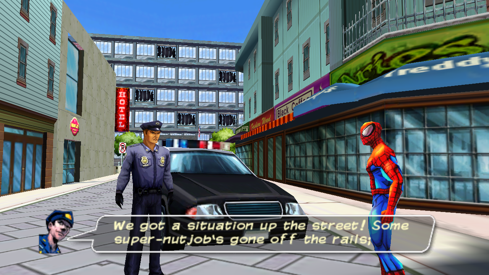
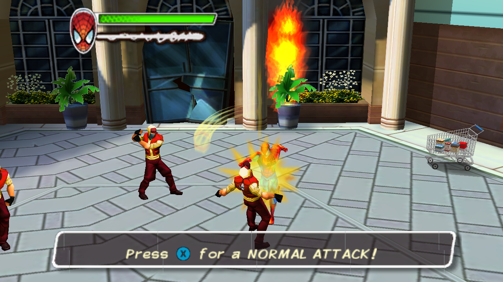
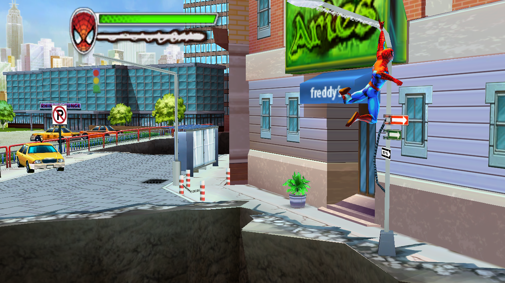

# OpenAndroidUSM

OpenAndroidUSM is a source-level C++ reconstruction of the Android/Xperia Play
release of *Ultimate Spider-Man: Total Mayhem*. The project rebuilds the game
systems from reverse-engineered native code and shipped data; it is not an
emulator, binary wrapper, or decompiled-source dump.

> [!IMPORTANT]
> This is an active reverse-engineering project, not a finished release.
> Opening cinematics and substantial gameplay flow are reconstructed, but
> combat and effects are still being audited against the original for 1:1
> parity. Expect incomplete later-game behavior and regressions.

## Screenshots

| Opening cutscene | First encounter combat | Web-swing gameplay |
| --- | --- | --- |
|  |  |  |

These images are deterministic readbacks from the Windows reconstruction, not
screenshots of the original executable.

## What is reconstructed

- Native C++20 application and game-runtime architecture
- Direct3D 11 rendering, authored transforms, materials, baked lightmaps,
  skeletal animation, UI, particles, and cinematic cameras
- XAudio2 playback and reconstructed music, dialogue, effects, and spatial
  sound dispatch
- Player traversal, collision, web swinging, wall movement, combat state
  graphs, targeting, damage, enemy behavior, cinematics, triggers, QTEs,
  checkpoints, hazards, and collectibles
- Deterministic autoplay scenarios with frame, state, audio, collision,
  object, enemy, and event telemetry

The reconstruction is developed chronologically through normal player flow.
Every gameplay decision is expected to come from the original ARM executable
or shipped data and to retain its native address or data source in comments and
audit notes. See [docs/RECONSTRUCTION.md](docs/RECONSTRUCTION.md) for the
technical record and [docs/LEVEL1_COMBAT_PARITY_AUDIT.md](docs/LEVEL1_COMBAT_PARITY_AUDIT.md)
for the active combat audit.

## Requirements

- Windows 10 or 11, x64
- Visual Studio 2022 with the Desktop development with C++ workload
- CMake 3.25 or newer
- A legally obtained Android game archive containing the original executable
  and data

Original binaries and assets are deliberately excluded from this repository.
They are imported into ignored local directories and remain the user's
responsibility.

## Import the game data

From a PowerShell prompt in the repository root:

```powershell
powershell -ExecutionPolicy Bypass -File tools/import_game.ps1 `
  -Archive "$env:USERPROFILE\Downloads\spiderman.7z"
```

The importer extracts the reference ARM library and game data beneath the
ignored `game/` tree and records hashes for reproducibility.

## Configure, build, and run

```powershell
cmake --preset windows-msvc-release
cmake --build --preset windows-msvc-release
.\build\windows-msvc\Release\OpenAndroidUSM.exe
```

The initial backend is Direct3D 11, but the game-facing renderer API is kept
independent of Direct3D so additional backends can be added later.

## Tests and deterministic autoplay

Run the native test targets through CTest:

```powershell
ctest --test-dir build/windows-msvc -C Release --output-on-failure
```

The executable can drive its normal application loop from a text scenario
without keyboard, mouse, controller, or window automation:

```powershell
.\build\windows-msvc\Release\OpenAndroidUSM.exe `
  --autoplay .\tests\autoplay\opening-baseline.usmauto `
  --output .\analysis\generated\opening-baseline
```

The output contains detailed CSV state and event traces, a pass/fail summary,
and any explicitly requested render readbacks. To run the complete scenario
set while automatically cleaning screenshots afterward:

```powershell
powershell -ExecutionPolicy Bypass -File tools/run_autoplay_suite.ps1
```

Use `-KeepCaptures` only for a deliberate visual audit. The suite manifest
records executable and script hashes so stale results cannot be mistaken for
current coverage. Autoplay proves repeatability of reconstructed behavior; it
does not by itself prove parity with the original game.

## Repository policy

The repository tracks reconstructed source, reviewed type and behavior notes,
tests, and analysis tooling. It does not track original game binaries, assets,
reverse-engineering databases, bulk generated decompiler output, or ordinary
build/test products.

*Ultimate Spider-Man* and related characters and assets belong to their
respective rights holders. This project is an unaffiliated preservation and
reverse-engineering effort and requires users to supply their own legally
obtained game data.
